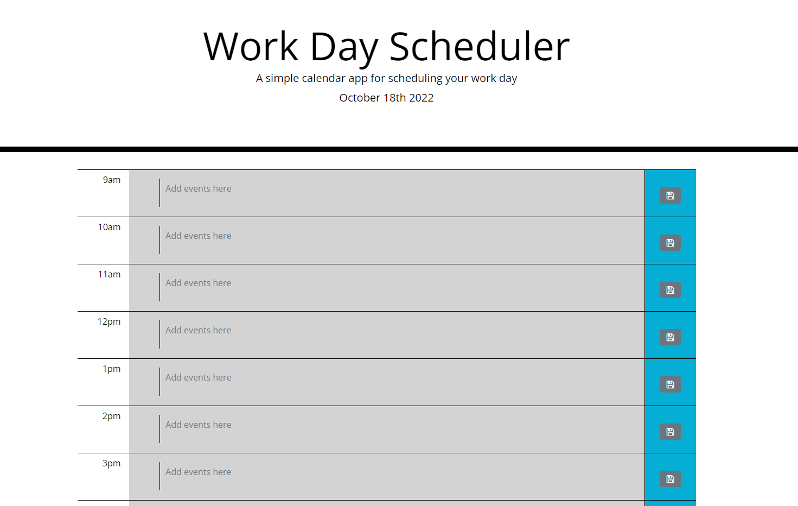
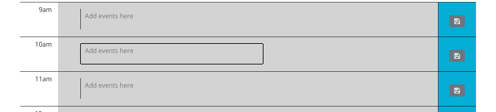
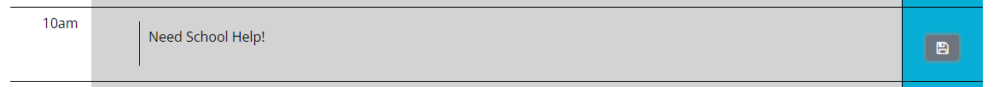

# Work-Scheduler

## Description

This project was used to further my understanding of jQuery and bootstrap.

## Table of Contents

 - [Installation](#installation)
 - [Usage](#usage)
 - [Credits](#credits)
 - [License](#license)

## Installation

To use this project the user needs to open the index.html in a browser. it can also be reached on github live pages from this link https://johnboy514.github.io/Quiz/

## Usage

To utilize this page a user can navigate to an open text field and click on it. The user is then able to click on it and write out a personal message. The user can then save this to local storage by clicking on the save btn to the right in the blue box. Once done the page can be refreshed but still hold the message. the boxes will change color based on the time of day. When its passes a time slot it will grey it out and when it is currently that time slot it will be red to signal its the current time block. the time blocks in the future will be highlighted green and would be where a user puts a note requesting help or to organize their schedule.

## Credits

Robert Obernier
https://github.com/rjo6615

## License

N/A